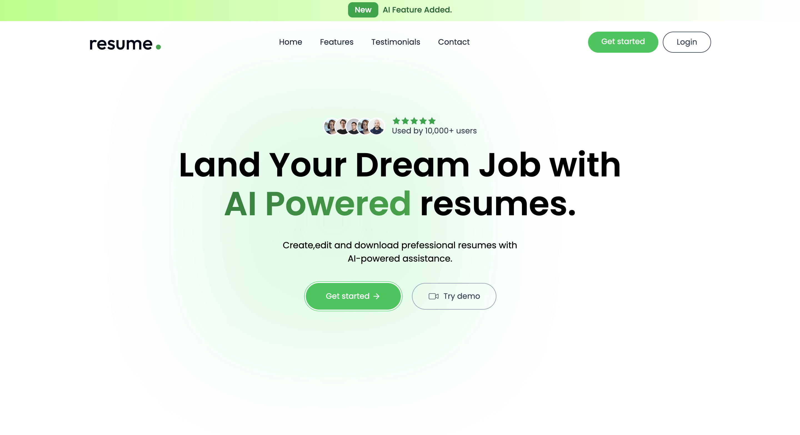
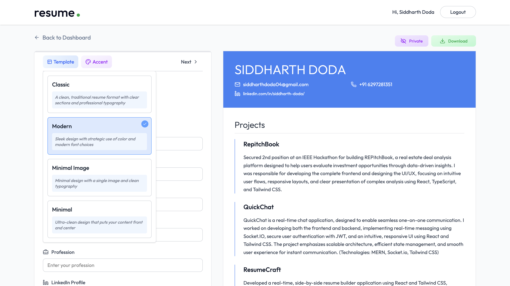
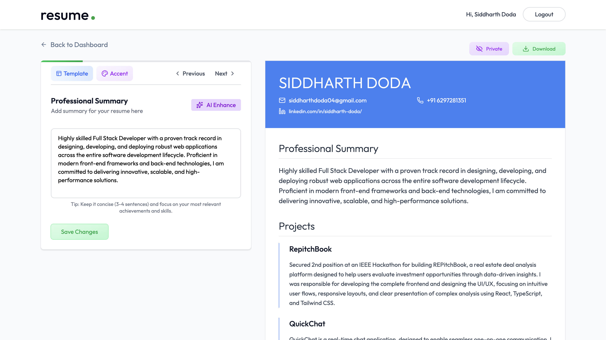

# 🚀 Resume Builder

An intelligent full-stack web application that helps users **create, analyze, and improve resumes using AI**.

It offers a variety of customizable templates and accent styles to design visually appealing, ATS friendly resumes.
Powered by the Gemini API, the backend delivers smart content enhancement, keyword optimization, and role-specific suggestions 
to help users stand out in competitive job markets.

## Features

* **Smart Suggestions**
  Improve summaries, skills, and descriptions using AI
  
* **Customizable Templates & accent styles**
Choose from multiple modern templates and color themes to create visually appealing resumes

* **ATS-Optimized Resumes**
  Generate resumes structured to pass Applicant Tracking Systems and increase shortlisting chances
  
* **Resume Parsing**
  Upload resume → Extract structured data automatically

* **Authentication System**
  Secure login & signup using JWT

* **Cloud File Uploads**
  Upload resumes using Cloudinary

## 🛠️ Tech Stack

**Frontend:**
React.js, Tailwind CSS

**Backend:**
Node.js, Express.js

**Database:** 
MongoDB

**AI Integration:**
OpenAI API

**Other Tools:**
Cloudinary (file uploads), Multer (handling files), JWT (authentication)

## Screenshots

### Home Page



### Resume Upload



### AI Feedback



## Installation

### Clone the repository

```bash
git clone https://github.com/your-username/ai-resume-builder.git
cd ai-resume-builder
```

### Install dependencies

```bash
# Backend
cd backend
npm install

# Frontend
cd ../frontend
npm install
```

### Environment Variables

Create a `.env` file in backend:

```env
PORT=3000
MONGODB_URI=your_mongodb_uri
OPENAI_API_KEY=your_openai_key
CLOUDINARY_CLOUD_NAME=your_cloud_name
CLOUDINARY_API_KEY=your_api_key
CLOUDINARY_API_SECRET=your_secret
JWT_SECRET=your_secret
```

### Run the project

```bash
# Backend
node server.js

# Frontend
npm run dev
```

## Deployment

* Frontend → Vercel / Netlify
* Backend → Render / Railway
* Database → MongoDB Atlas

## Author

**Siddharth Doda**
